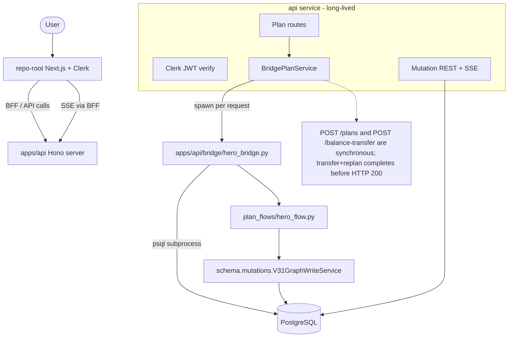
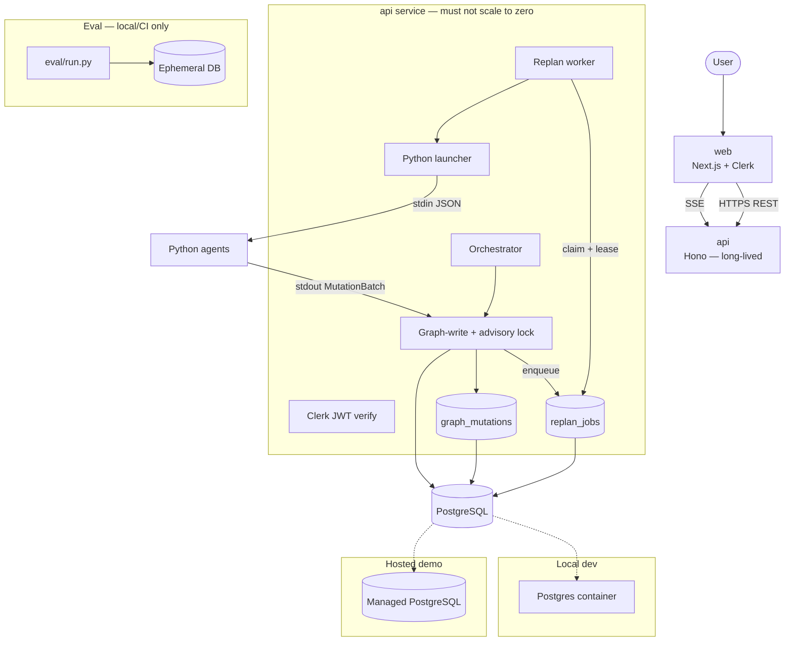

# Architecture Context — Rewards Agent

> How the system is structured, where boundaries are, and what must never break.

**Last updated:** 2026-06-27 · **Schema/spec version:** schema-final **v3.1** (`docs/architecture/schema-final.md`, `schema/schema.sql`)

**Approval status:** **Locked (ADR 0001 Accepted 2026-06-18).** Phase A DDL validated on clean PostgreSQL 16. Phase A3 contracts next.

**Implementation status:** `main` runs the demo through Hono routes in `apps/api`, `BridgePlanService`, and the Python `psql` bridge at `apps/api/bridge/hero_bridge.py`. The TypeScript orchestrator and agent harness are committed and tested, but they are not mounted in `apps/api/src/server.ts`; the async replan worker remains target architecture/post-demo work. Treat sections marked **target** as design intent, not the current runtime.

---

## Stack

| Layer             | Technology                                              | Role                                                                                                    |
| ----------------- | ------------------------------------------------------- | ------------------------------------------------------------------------------------------------------- |
| Frontend          | Next.js App Router at repo root; `apps/web` deferred    | Demo UI; Clerk client; BFF routes; SSE consumer; actionability from plan `status`                       |
| API shell         | Hono + TypeScript in `apps/api`                         | HTTP, Clerk, CORS, mutation REST/SSE, plan routes, Python bridge launcher                               |
| Demo plan runtime | Python `psql` bridge (`apps/api/bridge/hero_bridge.py`) | Current mounted plan creation and transfer+replan path; synchronous inline replan before `200` response |
| Graph-write       | Python `schema.mutations.V31GraphWriteService`          | Current graph write adapter over PostgreSQL and SQL functions                                           |
| TS orchestrator   | TypeScript in `apps/api/src/orchestrator`               | Tested contract/harness; **not mounted** in the live server on `main`                                   |
| Specialist agents | Python 3.11+ modules in `agents/`                       | Reasoning modules and target specialists; no direct DB access when used as agents                       |
| Database          | PostgreSQL                                              | Graph tiers, mutation audit log, replan job queue                                                       |
| Auth              | Clerk (identity only)                                   | Sign-in → `users.clerk_id`                                                                              |
| Contracts         | JSON Schema in `schema/contracts/` _(proposed)_         | Authoritative for API, mutation, subprocess, tool, benchmark, SSE                                       |
| Persistence DDL   | SQL in `schema/schema.sql`                              | Authoritative for relational structure (validated on clean PostgreSQL 16)                               |
| Generated types   | `packages/schema-ts/`, `agents/schema_py/` _(proposed)_ | Generated from JSON Schema only                                                                         |
| Evaluation        | Python CLI in `eval/` _(proposed)_                      | Local/CI only; ephemeral eval DB                                                                        |

No Redis, external queue, WebSocket server, or graph database in MVP.

---

## High-level diagrams

### Current demo runtime on `main`



### Target graph-native runtime



---

## System boundaries

| Boundary               | Path                                            | Owns                                                                | Must not own                          |
| ---------------------- | ----------------------------------------------- | ------------------------------------------------------------------- | ------------------------------------- |
| Frontend               | repo root `app/`; `apps/web/` post-demo         | UI, BFF routes, SSE client, displays `current` plans as actionable  | DB, agents, direct Hono calls         |
| API shell              | `apps/api/src/`                                 | HTTP, auth, CORS, mutation REST/SSE, route-to-service composition   | Redemption business logic             |
| Current plan bridge    | `apps/api/src/plans/bridge-service.ts`          | Spawning `hero_bridge.py`; env allowlist; JSON envelope translation | Non-DB secrets, graph semantics       |
| Current Python bridge  | `apps/api/bridge/hero_bridge.py`, `plan_flows/` | Plan creation, seed clone, transfer+inline replan, view projection  | Clerk secrets, frontend concerns      |
| Current graph-write    | `schema/mutations.py`                           | TransferPoints, OCC checks, dependencies, mutation log, replan jobs | HTTP/auth                             |
| Target TS orchestrator | `apps/api/src/orchestrator/`                    | Tested orchestration contracts and harness                          | Runtime claims until mounted          |
| Target async worker    | `apps/api/src/replan/worker.ts` _(not live)_    | Lease-based job claim; atomic revision promotion                    | Current demo transfer+replan behavior |
| Specialist agents      | `agents/*/`                                     | Target LLM-to-mutation reasoning from scoped snapshots              | Shell, DB, HTTP, secrets              |
| Schema                 | `schema/schema.sql`, `schema/contracts/`        | DDL and contracts                                                   | Hand-written duplicate types          |
| Eval                   | benchmark/eval Python CLIs                      | CLI + ephemeral DB                                                  | Demo deploy                           |

---

## Plan lifecycle (authoritative)

Overlapping fields are **not** independently mutable. **`plans.status` is the source of truth for actionability.**

### Plan revision status (`plans.status`)

| Status       | Meaning                                                              |
| ------------ | -------------------------------------------------------------------- |
| `generating` | Initial creation or re-plan revision being built                     |
| `current`    | **Only actionable revision** for this lineage                        |
| `stale`      | Invalidated by personal-state change; awaiting or undergoing re-plan |
| `failed`     | Generation or re-plan failed; not actionable                         |
| `superseded` | Replaced by a newer revision; historical only                        |

### Plan-step status (`plan_steps.status`)

| Status       | Meaning                                                              |
| ------------ | -------------------------------------------------------------------- |
| `proposed`   | Created during generation; not yet committed as part of current plan |
| `current`    | Active step on a `current` or `generating` plan revision             |
| `stale`      | Invalidated because depended-on personal state changed               |
| `superseded` | Belongs to a superseded plan revision                                |

**Rules:**

1. Only a plan with `status = 'current'` is actionable in the UI.
2. Only one revision per **`plan_lineage_id`** may have `status = 'current'` (partial unique index).
3. A user may have **many lineages** (separate goals/trips/conversations) — each with its own current revision.
4. On invalidation: current revision → `stale`; its steps → `stale`; `replan_jobs` enqueued in same txn.
5. Re-plan starts a new revision with `status = 'generating'`.
6. On success (atomic with job completion): new revision → `current`; prior → `superseded`; new steps → `current`.
7. On failure: prior revision stays `stale`; never restored to `current`.
8. **`is_current` is not used.** Do not add a boolean that can disagree with `status`.
9. **`plan_steps.is_stale` is not used.** Step actionability derives from step `status` and parent plan `status`.

### Lineage identifier

```sql
plan_lineage_id uuid NOT NULL  -- stable across all revisions of one planning conversation
revision_number integer NOT NULL DEFAULT 1
supersedes_plan_id uuid NULL REFERENCES plans(id)
```

```sql
CREATE UNIQUE INDEX plans_one_current_revision
  ON plans (plan_lineage_id)
  WHERE status = 'current';
```

**Do not** create `UNIQUE (user_id, …) WHERE status = 'current'` — that would incorrectly limit one current plan per user globally.

---

## Core data flow

### 1. Create a rewards plan

**Current demo runtime:** `POST /plans` calls `BridgePlanService.createPlan`, which spawns `hero_bridge.py`. The bridge uses the `psql` subprocess path and `schema.mutations.V31GraphWriteService` to write the plan, steps, dependencies, and mutation rows, then returns a full `status = current` plan in the same HTTP request. There is no mounted TS orchestrator loop or `generating` poll window on `main`.

**Target graph-native flow:**

1. Clerk auth → `users.id`.
2. Orchestrator creates plan: new `plan_lineage_id`, `revision_number = 1`, `status = generating`.
3. Graph-query builds scoped snapshot; Python subprocess receives JSON on stdin (no DB).
4. Graph-write commits steps (`status = current`), dependencies, `graph_mutations` under **per-user advisory lock**.
5. Plan → `status = current`; SSE emits events.

### 2. Update personal state and automatically re-plan

**Current demo runtime:** `POST /balance-transfer` calls the Python bridge, which runs `transfer_points`, marks the prior revision and dependent steps stale, claims the generated `replan_jobs` row, builds revision 2, and promotes it to `current` before returning `200`. The `replan_jobs` table is still written and completed, but no independent background worker is mounted on `main`.

**Target graph-native flow:**

1. Client may send `Idempotency-Key` header scoped per `(user_id, operation_type)`.
2. Graph-write **one transaction** (after `pg_advisory_xact_lock` for user):
   - Validate `TransferPoints`: amount > 0; source ≠ dest; both balances belong to user; sufficient source points.
   - Atomic debit/credit.
   - Current plan revision → `status = stale`; dependent steps → `status = stale`.
   - Insert `graph_mutations` (user-scoped; see below).
   - Insert `replan_jobs` with `source_plan_id` pointing at the now-stale revision.
   - Record idempotency outcome if key present.
3. Worker claims job (lease semantics below); creates revision `status = generating`.
4. Redemption agent subprocess produces new steps.
5. **Atomic promotion txn:** new revision → `current`; `source_plan_id` revision → `superseded`; job → `completed` with `result_plan_id`.
6. On failure after retries: job → `failed`; stale revision remains `stale` — never `current`.

### 3. External tool result

Tool adapter commits `external_quotes`; mutation logged user-scoped if tied to user's plan.

### 4. Benchmark

Ephemeral eval DB per run; baselines write minimal rows only; demo DB never touched.

---

## Storage model

| Store                 | Holds                            | Authoritative?                   |
| --------------------- | -------------------------------- | -------------------------------- |
| World graph           | Shared seed data                 | Yes (read-only in MVP app paths) |
| Personal graph        | Per-user wallet, goals           | Yes                              |
| Plan graph            | Lineages, revisions, steps, deps | Yes                              |
| `graph_mutations`     | User-scoped SSE/audit log        | Yes for per-user event order     |
| `replan_jobs`         | Durable work queue with leases   | Yes for re-plan work             |
| `idempotency_records` | Scoped dedup fingerprints        | Yes for retry safety             |

**REST graph endpoints are source of truth for application state.** SSE is an observable update channel only.

---

## Auth & access model

- Clerk: **identity only** — no orgs, roles, invitations, admin UI.
- Personal/plan data owned by one authenticated user (`user_id` on all scoped rows).
- World graph shared read-only.
- Demo persona = **bootstrap template** cloned on first login — not one global mutable user.
- **Authenticated per-user reset endpoint:** deletes or restores only that user's personal and plan state; shared world data are not reset; not part of ordinary demo behavior.
- **Global reset** (if implemented): requires `ADMIN_RESET_SECRET` (separate from Clerk); not ordinary user behavior.
- Eval CLI: no Clerk; fixture user on ephemeral DB.

---

## Complex patterns

### Hosted runtime

| Environment     | Web               | API                                         | PostgreSQL                                                                                          |
| --------------- | ----------------- | ------------------------------------------- | --------------------------------------------------------------------------------------------------- |
| **Local dev**   | Docker container  | Docker container (long-lived)               | **Docker Compose container**                                                                        |
| **Hosted demo** | Service/container | **Long-lived container** (no scale-to-zero) | **Managed PostgreSQL** (Railway/Render/Fly/Neon/etc.) — **not** an app container with attached disk |

The API service must not scale to zero — it owns SSE, route handling, database connections, and Python bridge subprocesses. The target async replan worker also requires an always-on API process once mounted.

Eval CLI: **local/CI only**, never deployed.

### Per-user graph-write serialization (SSE ordering)

- **What:** Before mutating graph state or inserting `graph_mutations`, graph-write acquires:

  ```sql
  SELECT pg_advisory_xact_lock(hashtextextended('graph_write:' || $user_id::text, 0));
  ```

- **Rule:** Serializes commits **per user**, not globally. Unrelated users write concurrently.
- **Guarantee:** `graph_mutations.id` (bigserial) reflects **commit order within a user's mutation stream**.
- **Not guaranteed:** Global cross-user ordering by `event_id`.
- **Recovery:** REST `GET /plans/:lineage/current` and `GET /mutations?after=` remain authoritative if SSE events missed.

### `graph_mutations` visibility (MVP)

- **Decision:** **User-scoped only** for MVP. Every row requires `user_id`.
- World-graph seed changes and Layer 4 global events are **excluded** from the mutation sidebar in MVP.
- No `visibility_scope` column until Layer 4 needs global events.
- SSE stream filters `WHERE user_id = authenticated_user`.

### Scoped idempotency

Table `idempotency_records`:

| Column             | Notes                          |
| ------------------ | ------------------------------ |
| `user_id`          | FK                             |
| `operation_type`   | e.g. `TransferPoints`          |
| `idempotency_key`  | Client header                  |
| `request_hash`     | Canonical hash of request body |
| `mutation_txn_id`  | Outcome reference              |
| `result_reference` | jsonb summary for replay       |
| `created_at`       |                                |

```sql
UNIQUE (user_id, operation_type, idempotency_key)
```

- Same key + same hash → return original outcome (no double apply).
- Same key + different hash → **409 idempotency conflict**.
- Different users may reuse the same key string independently.

### Durable `replan_jobs` with lease recovery

| Column                                       | Notes                                                        |
| -------------------------------------------- | ------------------------------------------------------------ |
| `id`                                         | uuid PK                                                      |
| `user_id`                                    | FK                                                           |
| `plan_lineage_id`                            | Lineage anchor                                               |
| `source_plan_id`                             | The stale revision at enqueue time (not "current")           |
| `trigger_mutation_txn_id`                    | Invalidating commit                                          |
| `idempotency_key`                            | UNIQUE per lineage + trigger                                 |
| `status`                                     | `pending`, `processing`, `completed`, `failed`, `superseded` |
| `attempt_count`                              | Incremented on each claim                                    |
| `max_attempts`                               | Default 3                                                    |
| `available_at`                               | Claimable when `<= now()`; backoff on retry                  |
| `locked_at`                                  | Set on claim                                                 |
| `locked_by`                                  | `hostname:pid`                                               |
| `lease_expires_at`                           | Reclaim if worker crashes                                    |
| `result_plan_id`                             | New revision on success                                      |
| `error`                                      | Last failure                                                 |
| `created_at` / `updated_at` / `completed_at` |                                                              |

**Claiming:**

- Worker may claim `pending` jobs where `available_at <= now()`.
- Worker may reclaim `processing` jobs where `lease_expires_at < now()`.
- Use `FOR UPDATE SKIP LOCKED`; set `status = processing`, increment `attempt_count`, set lease.
- After `max_attempts` → `failed`; set `available_at` with exponential backoff on retry.
- New invalidation → supersede in-flight job for same lineage.

**Promotion (before completing job):**

- Worker receives a lease token or verifies `locked_by` plus an **active lease** (`lease_expires_at > now()`).
- Before promotion, worker confirms it still owns the job and the lease has not expired.
- A worker whose lease expired **must not** promote a revision, even if its LLM call returns later.
- Winning worker atomically promotes: new revision → `current`; source revision → `superseded`; job → `completed` with `result_plan_id`.
- Duplicate attempts that discover an already-promoted lineage terminate without changing state.
- On failure after max attempts: job → `failed`; source revision stays `stale` — never restored to `current`.

**Atomic completion:** Job `completed` + new revision `current` + prior `superseded` in **one transaction**.

### Target Python subprocess operational contract

The target agent contract below applies to specialist agent subprocesses. The current demo bridge is intentionally different: it is the API's plan/replan database access layer, so it receives `DATABASE_URL` / `PG*` and talks to Postgres through `psql`.

This contract is target/post-demo unless and until `schema/contracts/agent-invocation.json` and an API launcher are added:

| Rule         | Requirement                                                                      |
| ------------ | -------------------------------------------------------------------------------- |
| Spawn        | `spawn()` without shell                                                          |
| I/O          | JSON stdin → stdout only for contract payload                                    |
| Exit codes   | `0` = success; `1` = validation error; `2` = timeout; other = unexpected failure |
| Timeout      | Configured execution timeout; kill process on exceed                             |
| Output limit | Configured maximum output size; exceed → validation failure                      |
| Environment  | Allowlist only (`PYTHONPATH`, agent config); **no `DATABASE_URL`**               |
| stdout       | Exactly one JSON document; extra output → validation failure                     |
| stderr       | Logs only; sanitized before persistence                                          |
| Credentials  | None passed to subprocess                                                        |

### Target agent read boundary

- All reads via graph-query in API process.
- Subprocess receives scoped snapshot JSON only.
- No direct SQL from Python.

### Type ownership

- JSON Schema → authoritative contracts; TS/Python generated; manual duplication prohibited.
- SQL DDL → authoritative persistence.
- Contract tests verify mutation JSON maps to writable columns.

---

## Integration contracts

| Contract           | Shape                                                                                                                                  | Owner      |
| ------------------ | -------------------------------------------------------------------------------------------------------------------------------------- | ---------- |
| Planning request   | `{ query_text, plan_lineage_id? }`                                                                                                     | Raq        |
| TransferPoints     | JSON Schema + idempotency header                                                                                                       | Alan       |
| Agent invocation   | Snapshot + limits in `agent-invocation.json`                                                                                           | Raq        |
| Agent stdout       | Single `MutationBatch` JSON                                                                                                            | Alan       |
| SSE event          | one row per `graph_mutations` insert — [`schema/contracts/mutation-event.schema.json`](../schema/contracts/mutation-event.schema.json) | Alan + Val |
| Idempotency record | Table above                                                                                                                            | Alan       |
| Replan job         | Table above                                                                                                                            | Alan       |

---

## Invariants (must never violate)

1. Specialist agents do not coordinate through free-text messages.
2. All persistent mutations go through graph-write.
3. All mutations schema-validated before commit.
4. Transfers cannot partially commit.
5. Personal-state invalidation + replan job enqueue occur in the **same transaction** as the balance change.
6. Only `plans.status = 'current'` is actionable; only one per `plan_lineage_id`.
7. A user may have many lineages; never enforce one current plan per user globally.
8. Stale/superseded revisions and steps are never presented as actionable.
9. Failed re-plan never restores a stale revision to `current`.
10. Re-plan success creates a new revision; prior becomes `superseded` atomically with job completion.
11. Python specialist agents have no database credentials; the current demo bridge is the explicit API DB-access exception and must not receive Clerk or other non-DB secrets.
12. `graph_mutations` is audit/SSE only; `replan_jobs` is the durable replan lifecycle table. On `main`, the bridge claims and completes jobs inline rather than a mounted background worker doing it.
13. Idempotency keys scoped by `(user_id, operation_type, idempotency_key)`.
14. Per-user advisory lock held for graph-write txs that insert `graph_mutations`.
15. `event_id` ordering guaranteed **within a user's stream only**.
16. REST graph state is source of truth; SSE is observability.
17. Benchmark uses ephemeral eval DB only.
18. Layer 4 not required for core demo.
19. Secrets never in client, logs, fixtures, or repo.
20. Generated types must match JSON Schema.

---

## Environment & deployment

### Local development

| Unit       | Form                                         |
| ---------- | -------------------------------------------- |
| `web`      | Docker Compose container                     |
| `api`      | Docker Compose container (long-lived)        |
| PostgreSQL | **Docker Compose container** (`postgres:16`) |
| Eval       | Host or CI; ephemeral DB container per run   |

```bash
docker compose up  # web + api + postgres
```

### Hosted demo

| Unit       | Form                                                                                         |
| ---------- | -------------------------------------------------------------------------------------------- |
| `web`      | Platform service or container (Vercel/Netlify for static, or container)                      |
| `api`      | **Long-lived container/service** — min instances = 1; no scale-to-zero                       |
| PostgreSQL | **Managed database** (Railway Postgres, Render Postgres, Fly Postgres, Neon, Supabase, etc.) |
| Eval       | **Not deployed**                                                                             |

`DATABASE_URL` points at managed instance — not a co-located Postgres container with ephemeral disk.

**Why API cannot be serverless-only:** SSE, Python bridge subprocesses, connection pooling, and the target replan worker once mounted.

---

## Schema change checklist (v3.1 — implementation-ready)

| Item                          | Required | Spec                                                                                                |
| ----------------------------- | -------- | --------------------------------------------------------------------------------------------------- |
| `plan_lineage_id`             | Yes      | Stable UUID per conversation; not self-referential                                                  |
| `plans.status` lifecycle      | Yes      | `generating`, `current`, `stale`, `failed`, `superseded` — replaces ambiguous old set for revisions |
| `plan_steps.status` lifecycle | Yes      | `proposed`, `current`, `stale`, `superseded` — drop `is_stale` boolean                              |
| Drop `is_current`             | Yes      | Use `status = 'current'` + partial unique index only                                                |
| Lineage unique index          | Yes      | `(plan_lineage_id) WHERE status = 'current'` — **not** per-user                                     |
| `graph_mutations`             | Yes      | `bigserial id`, `mutation_txn_id`, `user_id NOT NULL`, user-scoped MVP                              |
| `replan_jobs`                 | Yes      | Lease fields; `source_plan_id`; statuses without separate `claimed`                                 |
| `idempotency_records`         | Yes      | `UNIQUE (user_id, operation_type, idempotency_key)` + `request_hash`                                |
| `users.clerk_id`              | Yes      | UNIQUE                                                                                              |
| Per-user advisory lock        | Yes      | Document in graph-write spec, not a table                                                           |
| TransferPoints validation     | Yes      | Domain rules in §5 + idempotency                                                                    |
| Indexes                       | Yes      | `(user_id, id)` on mutations; `(status, available_at) WHERE pending` on jobs; lineage current index |

### Conflicts with schema-final v3 (resolved in v3.1)

| v3                                               | v3.1 correction                                          | Status   |
| ------------------------------------------------ | -------------------------------------------------------- | -------- |
| `plans.status` = pending/in_progress/completed/… | Lifecycle §4.1 in schema-final v3.1                      | **Done** |
| `plan_steps.is_stale` boolean                    | `status = stale` only                                    | **Done** |
| In-place re-plan refresh                         | Plan revision model                                      | **Done** |
| Missing infrastructure tables                    | `graph_mutations`, `replan_jobs`, `idempotency_records`  | **Done** |
| Per-user current plan index                      | Per-lineage `(plan_lineage_id) WHERE status = 'current'` | **Done** |

---

## Open decisions (post-correction)

| Item                                 | Owner | Blocks schema?                                                |
| ------------------------------------ | ----- | ------------------------------------------------------------- |
| Cash-price API provider              | Raq   | No                                                            |
| Hosted platform choice               | Raq   | No                                                            |
| Codegen tool + `schema/contracts/`   | Alan  | Blocks app lanes — **next (Phase A3)**                        |
| Subprocess timeout and output limits | Raq   | No — values set in finalized `agent-invocation.json` contract |
| Lane sign-off on v3.1 (§13)          | All   | No                                                            |

---

## Related docs

- [`project-overview.md`](project-overview.md)
- [`docs/architecture/schema-final.md`](../docs/architecture/schema-final.md) **v3.1** — current specification (supersedes `schema-v2.md`)
- [`schema/schema.sql`](../schema/schema.sql)
- [`decisions-log.md`](decisions-log.md)
- [`docs/adr/`](../docs/adr/)
