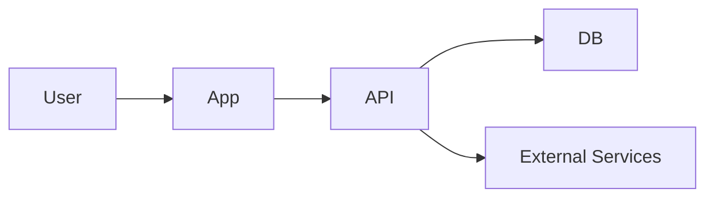

# Architecture Context — [Project Name]

> How the system is structured, where boundaries are, and what must never break.

**Last updated:** [YYYY-MM-DD] · **Schema/spec version:** [if applicable]

---

## Stack

| Layer | Technology | Role |
|---|---|---|
| [e.g. Framework] | [e.g. Next.js, FastAPI, Rails] | [one-line role] |
| [e.g. Database] | [e.g. PostgreSQL] | [one-line role] |
| [e.g. Auth] | [e.g. Clerk, Auth0, custom JWT] | [one-line role] |
| [e.g. Background jobs] | [e.g. Trigger.dev, Sidekiq] | [one-line role] |
| [e.g. External APIs] | [names] | [one-line role] |

_Delete rows that don't apply._

---

## High-level diagram

Describe or paste a diagram. Mermaid is fine.

_[Replace with your actual topology]_

---

## System boundaries

Map directories/modules to responsibilities. Agents must not cross these without reason.

| Boundary | Path / service | Owns | Must not own |
|---|---|---|---|
| [e.g. API layer] | `[path]` | [requests, validation, auth] | [long-running jobs, UI state] |
| [e.g. Domain / lib] | `[path]` | [business rules, shared types] | [HTTP, DB drivers directly in handlers] |
| [e.g. UI] | `[path]` | [rendering, local UI state] | [direct DB access] |
| [e.g. Workers] | `[path]` | [async jobs, retries] | [user-facing request latency] |

---

## Core data flow

### [Primary flow name, e.g. "Request → response"]

1. [Entry point]
2. [Validation / auth]
3. [Domain logic]
4. [Persistence]
5. [Response / side effects]

### [Secondary flow, e.g. "Background job"]

1. …

---

## Storage model

| Store | Holds | Does not hold |
|---|---|---|
| [e.g. PostgreSQL] | [metadata, relationships, transactional state] | [large blobs, generated files] |
| [e.g. Object storage] | [files, exports, snapshots] | [queryable relational joins] |
| [e.g. Cache / realtime] | [sessions, presence, ephemeral state] | [source of truth] |

**Rule of thumb:** [e.g. "Metadata in DB; artifacts in blob storage; reference by URL in DB."]

---

## Auth & access model

- **Identity:** [how users are identified]
- **Authorization:** [roles, ownership, resource-level checks]
- **Public vs protected:** [what's open, what's gated]
- **Service-to-service:** [API keys, mTLS, none]

---

## Complex patterns

Document non-obvious patterns agents must follow. Delete sections that don't apply.

### [Pattern 1, e.g. "Optimistic concurrency"]
- **What:** [brief]
- **Where:** [tables/modules]
- **Rule:** [e.g. "Every write carries observed version; reject stale commits"]

### [Pattern 2, e.g. "Event sourcing / mutation log"]
- **What:** …
- **Rule:** …

### [Pattern 3, e.g. "Multi-agent coordination"]
- **What:** …
- **Rule:** …

---

## Integration contracts

| Integration | Direction | Contract shape | Owner |
|---|---|---|---|
| [e.g. Webhook from X] | inbound | [payload schema] | [lane/person] |
| [e.g. Tool API] | outbound | [response format] | [lane/person] |

---

## Invariants (must never violate)

Number these. Violating an invariant is a bug, not a style issue.

1. [e.g. "All mutations go through a single write path"]
2. [e.g. "Auth checked before any mutation"]
3. [e.g. "Long-running work never blocks HTTP handlers"]
4. [e.g. "No secrets in client bundles or logs"]
5. [Add project-specific invariants]

---

## Environment & deployment

| Environment | Purpose | URL / notes |
|---|---|---|
| local | dev | [how to run] |
| staging | pre-prod | [URL] |
| production | live | [URL] |

**Required env vars:** [list or point to `.env.example`]

---

## Related docs

- Product: [`project-overview.md`](project-overview.md)
- Decisions: [`decisions-log.md`](decisions-log.md)
- Risks: [`risks-and-failure-modes.md`](risks-and-failure-modes.md)
- Formal ADRs: `[path, e.g. docs/adr/]` _(if used)_
