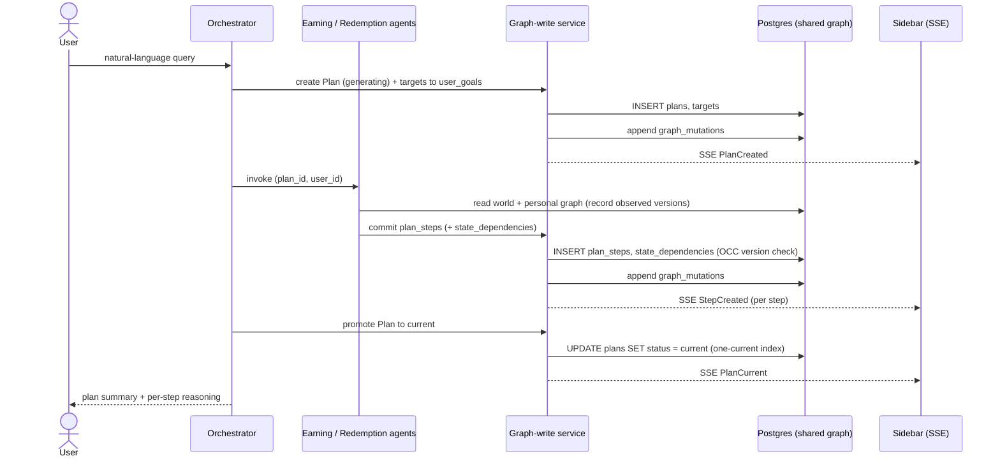
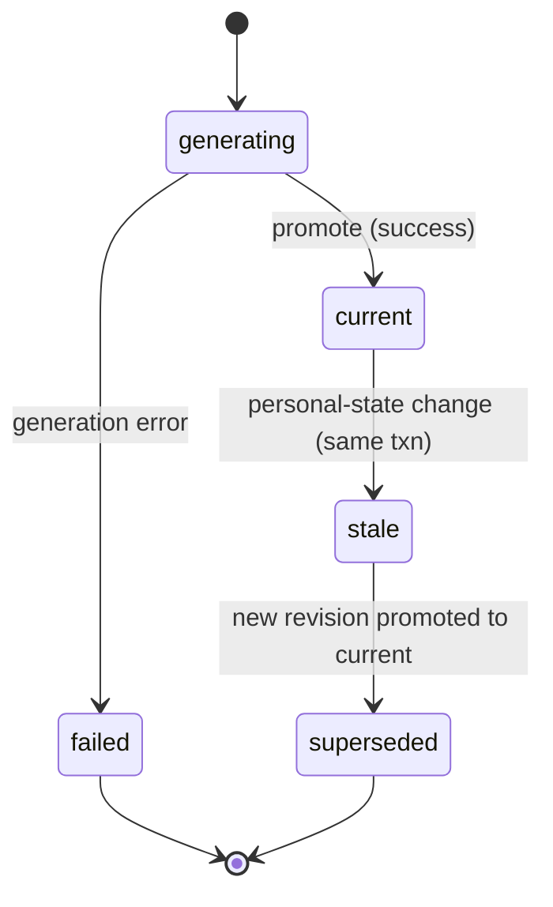

# Orchestration Flow

> How the orchestrator coordinates the specialist agents through the shared typed graph. Companion to [`schema-final.md` v3.1](schema-final.md) — every table named here is defined there.

**Status:** Design (target behavior under the locked v3.1 schema). The orchestrator + agent harness (RCG-15, [spec 05](../../context/feature-specs/05-orchestrator-harness.md)) is scaffolding on mocks; the real graph-write path is Alan's lane and comes online as the generated contracts/types land (PR #2).

**The one constraint:** coordination is state, not messages. Agents never exchange free text. Every interaction is a typed, schema-validated mutation to the shared graph. The orchestrator conducts; the graph is the channel.

---

## Actors and what they may write

The mutation-ownership matrix (schema §6.2) is the anti-collision rule: each writer owns a disjoint slice, so concurrent agents never fight for the same row.

| Actor | Reads | May write |
|---|---|---|
| Orchestrator | world + personal + plan graph | `plans`, `targets` |
| Wallet agent | personal graph | personal-tier nodes (`user_balances`, `user_program_statuses`, `user_goals`) |
| Earning agent | world + personal | its own `plan_steps` contributions |
| Redemption agent | world + personal + plan | `plan_steps`, `state_dependencies` |
| Graph-write service | — | `graph_mutations`, `replan_jobs`, `idempotency_records`, staleness propagation |

Every agent also opens its own `agent_runs` row (audit, `last_read_versions`, token count).

---

## Happy path: query → plan

Plain version: the orchestrator creates an empty Plan pointed at the user's goal, the agents read the same graph and write their pieces of the plan, every write streams to the sidebar, and when the pieces are in the plan is promoted to the one `current` revision the UI shows.



Step by step, mapped to tables:

1. Orchestrator inserts a `plans` row: new `plan_lineage_id`, `revision_number = 1`, `status = generating`, `plan_type = agent_generated`, `query_text`; links the goal via a `targets` row to `user_goals` (schema §4.2, §4.5).
2. Agents read the world graph (`credit_cards`, `reward_programs`, `earns`, `transfers_to`, `redeems_via`) and personal graph (`user_balances`, `holds`, statuses), recording the `version` of each row they read so dependencies are precise.
3. Earning agent writes `plan_steps` of type `card_assignment` / `spend_analysis`. Redemption agent does the multi-hop traversal (balance → `transfers_to` → `redeems_via` → `redemption_options`) and writes `plan_steps` of type `redemption_recommendation` / `transfer_recommendation`, plus a `state_dependencies` row per step recording `target_node_id`, `observed_version`, `snapshot_value` (schema §4.3, §4.4).
4. Each commit appends `graph_mutations` rows; that append-only log is the SSE stream the sidebar renders (schema §5.1).
5. Orchestrator promotes the plan to `status = current`. The partial unique index `plans_one_current_revision` guarantees exactly one current revision per lineage; the UI only renders `current` (schema §4.1).

---

## Hero moment: state changes, plan self-heals

Plain version: when a balance moves, the same transaction that writes the balance also flags the affected plan and its steps stale and drops a re-plan job on a durable queue. A worker picks it up and the redemption agent builds a fresh revision that atomically replaces the old one. The orchestrator is not in this loop — invalidation is structural, driven by the recorded dependencies.

```mermaid
sequenceDiagram
    actor U as User
    participant W as Wallet agent
    participant G as Graph-write service
    participant DB as Postgres (shared graph)
    participant Wk as Re-plan worker
    participant R as Redemption agent
    participant S as Sidebar (SSE)

    U->>W: balance changed (or TransferPoints)
    W->>G: commit balance change (carries observed version)
    Note over G,DB: one transaction (schema §6.3-6.4)
    G->>DB: pg_advisory_xact_lock(user)
    G->>DB: UPDATE user_balances (version + 1)
    G->>DB: mark current plan + steps stale
    G->>DB: INSERT replan_jobs (pending)
    G->>DB: append graph_mutations
    G-->>S: SSE BalanceChanged, PlanStale
    Wk->>DB: claim job (FOR UPDATE SKIP LOCKED, lease)
    Wk->>R: build new revision
    R->>G: new plans (generating, rev + 1) + steps + deps
    Note over G,DB: atomic promotion (schema §6.5)
    G->>DB: new to current; old to superseded; job to completed
    G-->>S: SSE PlanReplanned
```

Why this is the differentiator: a flat rules table can answer a fresh query, but it cannot know that an *existing* plan depended on the balance that just moved. Here the `state_dependencies` edges make that knowledge structural, so invalidation and re-plan happen without anyone re-checking by hand or routing a message (schema §4.4, §6.4-6.5).

---

## Plan revision lifecycle

`plans.status` is authoritative for UI actionability — there is no `is_current` boolean (schema §4.1).



`plan_steps.status` mirrors this: `proposed → current → stale → superseded`. Baseline plans (`baseline_single_agent`, `baseline_free_text_multiagent`) use a simplified `completed` / `failed` only and write no steps or dependencies (schema §4.1, §8).

---

## Guardrails that keep concurrent agents safe

- **Optimistic concurrency (schema §6.1):** every mutable write is conditional on the `version` it read (`WHERE id = $id AND version = $expected`). Row count 0 means a conflict; retry, max 3.
- **Per-user write serialization (schema §6.3):** a `pg_advisory_xact_lock` per user before graph writes keeps `graph_mutations.id` ordered per user, so the sidebar stream is coherent. This is per-user, not global ordering.
- **Ownership matrix (schema §6.2):** disjoint write slices mean no two agents contend for the same row.
- **Idempotency (schema §5.3):** scoped key + request fingerprint. Same key + same body replays the outcome; same key + different body returns a 409.

---

## What is real vs mocked right now

- **Real on `main`:** schema v3.1 + DDL; generated types/contracts in PR #2.
- **Mocked:** the orchestrator + harness run against mock mutations and mock SSE events (spec 05) until the graph-write contract lands. Wallet + earning agents follow (spec 06). The redemption traversal is Michael's lane (spec 04).

---

## Related

- Schema: [`schema-final.md` v3.1](schema-final.md) — §4 plan graph, §5 write-path infra, §6 graph-write contract.
- Specs: [05 orchestrator + harness](../../context/feature-specs/05-orchestrator-harness.md) · [06 wallet + earning](../../context/feature-specs/06-wallet-and-earning-agents.md) · [02 graph write path](../../context/feature-specs/02-graph-write-path.md) · [03 mutation log + SSE](../../context/feature-specs/03-mutation-log-sse.md) · [04 redemption traversal](../../context/feature-specs/04-redemption-traversal.md)
- Decision: [ADR 0001 — schema lock](../adr/0001-schema-lock.md)
