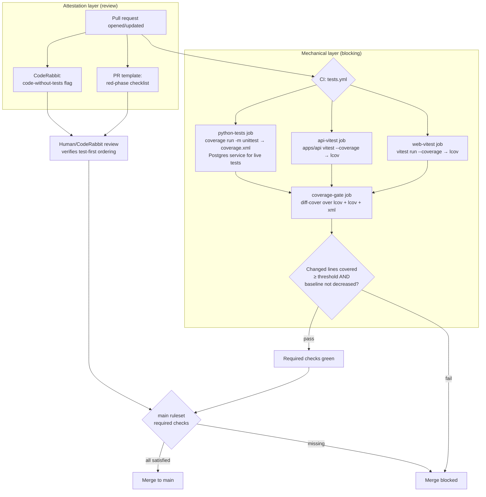

# feat: Enforce TDD across the codebase as a team requirement

**Target repo:** rewards-typed-graph (this repo). All paths below are repo-relative.

---

## Summary

Make test-driven development a real, enforced standard for the whole repo — not just a per-spec convention. Today tests exist in three runners but CI runs almost none of them, the merge gate is effectively CodeRabbit-only, and the written testing policy in `context/code-standards.md` is an unfilled template. This plan closes the gap with a **two-layer enforcement model**:

1. **Mechanical layer (CI):** every PR runs all three test suites, must pass, and must satisfy a **diff-coverage ratchet** (new/changed lines must be covered; total coverage can't drop). These become required status checks on `main`.
2. **Attestation layer (process):** a PR template red-phase checklist plus CodeRabbit/human review enforces the *test-first ordering* that CI cannot prove.

Scope is **this repo, all stacks**. Out of scope: backfilling tests for existing untested code to chase a global %, and any product/feature behavior change.

---

## Problem Frame

**Current reality (verified 2026-06-25):**

- **Three test runners, three roots:**
  - Root Vitest (`vitest run`) — web code (`lib/`, `app/`, `components/`); config excludes `apps/api`.
  - `apps/api` Vitest (`cd apps/api && vitest run`) — orchestrator, agents, routes.
  - Python `unittest` — `tests/**`; several tests gated by `RUN_LIVE_POSTGRES_TESTS`.
- **CI does almost nothing for tests.** `.github/workflows/schema-postgres.yml` only applies the schema and runs **2 specific live-Postgres Python test classes**. It does not run the full Python suite, either Vitest suite, lint, typecheck, or coverage.
- **No coverage tooling anywhere** — no `@vitest/coverage-v8`, no `coverage.py` config, no thresholds, no hooks, no `CONTRIBUTING.md`.
- **Merge gate is thin.** `AGENTS.md` states `main` requires a passing **CodeRabbit** check only. `context/code-standards.md` → Testing section is still placeholder text (`[unit / integration / e2e]`, `[none / critical paths / % target]`).
- **Test-first is only spec-local.** `context/ai-workflow-rules.md` says "write the tests named in the spec first"; only Spec 05 (`context/feature-specs/05-orchestrator-harness.md`) mandates a recorded red phase in `AI_USAGE.md`. There is no repo-wide rule.

**Goal:** a TDD requirement that is (a) written down as the canonical standard, (b) mechanically enforced for both stacks on every PR, and (c) blocking on `main`.

---

## Requirements

- **R1** — All three test suites run on every PR and a failure blocks merge.
- **R2** — New or changed code must be covered by tests (diff-coverage gate on changed lines), across both stacks.
- **R3** — Total coverage must not decrease (ratchet baseline per stack).
- **R4** — The test/coverage checks are **required status checks** on the `main` ruleset.
- **R5** — TDD is documented as the canonical team standard, with one source of truth and links from `AGENTS.md`, `context/code-standards.md`, `context/ai-workflow-rules.md`, and `context/decisions-log.md`.
- **R6** — Every PR carries a red-phase / test-first attestation (PR template), and CodeRabbit flags code changes lacking matching test changes.
- **R7** — All test/coverage commands are runnable locally with documented one-liners, so the CI gate is reproducible before pushing.

---

## High-Level Technical Design

Two enforcement layers around a single PR. CI is the mechanical gate; the PR template + reviewers are the attestation gate.



**What each layer can and cannot guarantee:**

| Guarantee | Enforced by | Mechanical? |
| --- | --- | --- |
| Tests exist for changed code | diff-cover gate (R2) | Yes |
| Tests pass | CI suites (R1) | Yes |
| Coverage doesn't regress | ratchet baseline (R3) | Yes |
| Blocking on merge | `main` ruleset required checks (R4) | Yes |
| Tests were written **first** (red→green) | PR attestation + review (R6) | No — process only |

---

## Key Technical Decisions

- **KTD1 — Diff-coverage as the primary TDD signal, not a global % target.** Use `diff-cover` (Bachmann1234) via the `Affanmir/diff-cover-action@v2` wrapper, which consumes Cobertura XML **and** lcov, so all three runners feed one gate that scores only changed lines. *Why:* a global "80% repo coverage" gate would either break every build immediately (CI runs no tests today) or reward padding old code; diff-coverage directly encodes "new code must be tested," which is the TDD outcome. *Trade-off:* diff-cover can miss multi-line statements (mitigate with `--expand-coverage-report`). *Analogy:* it grades only the homework you turned in this week, not the whole semester.
- **KTD2 — Ratchet baseline per stack via committed thresholds.** Set explicit `coverage.thresholds` in each Vitest config and a `fail_under` in `coverage.py`, initialized to the **current** measured numbers, raised over time. *Why:* guarantees "can't decrease" (R3) without a brittle external baseline store. *Trade-off:* thresholds are bumped manually after big coverage gains. *Alternative considered:* compare PR total vs base-branch total via a coverage-report action — more automation, more moving parts; deferred.
- **KTD3 — `coverage.py` drives Python, keeping `unittest`.** Run `coverage run -m unittest discover` → `coverage xml`. *Why:* repo uses stdlib `unittest` (no pytest config); `coverage.py` wraps it without a framework migration. *Trade-off:* none material. *Alternative:* migrate to `pytest` + `pytest-cov` — larger change, deferred.
- **KTD4 — Python CI job provides a Postgres service.** Mirror the `postgres:16` service from `schema-postgres.yml` and set `RUN_LIVE_POSTGRES_TESTS=1` so the full suite (including live tests) runs and counts toward coverage. *Why:* otherwise live-gated tests silently skip and under-report coverage. *Trade-off:* slightly slower CI.
- **KTD5 — Two-layer model; attestation for ordering.** CI proves existence/passing/coverage; a PR-template red-phase checklist + CodeRabbit `path_instructions` enforce test-first ordering. *Why:* honest — no CI can prove a test was authored before code. *Trade-off:* the "first" guarantee is social, not mechanical (accepted per scoping).
- **KTD6 — One source of truth for the policy.** The canonical TDD policy lives in `context/code-standards.md` → Testing; everything else links to it (no duplication), matching the repo's existing "link, don't duplicate" rule in `ai-workflow-rules.md`.

---

## Output Structure

New files this plan introduces (modified files omitted):

```text
.coveragerc                              # or [tool.coverage] block — Python coverage config
apps/api/vitest.config.ts                # add coverage block if not present
.github/workflows/tests.yml              # all-suites + coverage-gate workflow
.github/pull_request_template.md         # red-phase attestation checklist
docs/adr/0009-tdd-enforcement.md         # durable decision record
docs/plans/2026-06-25-001-feat-tdd-enforcement-plan.md  # this plan
```

---

## Implementation Units

### U1. Add coverage tooling and local test commands for all three stacks

**Goal:** Make every suite runnable locally with coverage, emitting machine-readable reports the CI gate will consume.
**Requirements:** R7, R2 (enables), R3 (enables)
**Dependencies:** none
**Files:**
- `package.json` — add `test:coverage` (`vitest run --coverage`), ensure `@vitest/coverage-v8` devDep.
- `vitest.config.ts` — add `coverage` block: provider `v8`, reporters `['text','lcov','json-summary']`, `reportsDirectory: coverage/web`, `thresholds` seeded to current numbers.
- `apps/api/package.json` — add `test:coverage`; add `@vitest/coverage-v8`.
- `apps/api/vitest.config.ts` — create/extend with the same coverage block, `reportsDirectory: coverage/api`.
- `.coveragerc` (or `[tool.coverage.run]`/`[tool.coverage.report]` in a new `pyproject.toml`) — `source = .`, omit `tests/*`, `fail_under` seeded to current number, `xml` output to `coverage/python/coverage.xml`.
- `package.json` — add a convenience `test:py:coverage` script documenting `coverage run -m unittest discover && coverage xml`.

**Approach:** Measure current coverage first (run each suite with coverage once) and seed thresholds to those measured values so U1 itself never regresses the build. Keep Vitest `v8` provider (default, AST-accurate since 3.2). Python live tests need Postgres locally; document that the non-live subset still produces a valid report when Postgres is absent.
**Patterns to follow:** existing `vitest.config.ts` on `main` (alias + `server-only` stub); existing env-gated test pattern in `tests/integration/`.
**Test scenarios:** `Test expectation: none — tooling/config unit.` Verification below proves it.
**Verification:** `npm run test:coverage`, `(cd apps/api && npm run test:coverage)`, and `coverage run -m unittest discover && coverage xml` each succeed locally and write reports under `coverage/`. Re-running with an artificially lowered threshold fails, confirming the gate is wired.

---

### U2. CI workflow that runs all three suites on every PR

**Goal:** Every PR runs web Vitest, api Vitest, and the full Python suite; any failure blocks merge.
**Requirements:** R1
**Dependencies:** U1
**Files:**
- `.github/workflows/tests.yml` — new workflow, `on: pull_request` + `push: [main]`. Three jobs: `web-vitest`, `api-vitest`, `python-tests`. `python-tests` declares a `postgres:16` service (copy health-check block from `schema-postgres.yml`) and sets `RUN_LIVE_POSTGRES_TESTS=1`. Each job uploads its coverage report as an artifact.

**Approach:** Node 22 with `actions/setup-node` cache; `npm ci` at root and in `apps/api`. Python 3.12 via `actions/setup-python`; `pip install coverage`. Pin third-party actions by SHA to match the existing workflow's security posture (`persist-credentials: false`). Keep `schema-postgres.yml` as-is (it's already a required check); `tests.yml` is additive.
**Patterns to follow:** `.github/workflows/schema-postgres.yml` (Postgres service, SHA-pinned checkout, PG env vars, `apply_schema_postgres.sh`).
**Test scenarios (validation, run as a draft PR):**
- A PR with a deliberately failing Vitest test → `web-vitest` (or `api-vitest`) job fails. Covers R1.
- A PR with a failing Python assertion → `python-tests` job fails. Covers R1.
- A green PR → all three jobs pass and upload artifacts.
**Verification:** Open a draft PR; confirm all three jobs trigger, pass on clean code, and that each uploads a coverage artifact consumable by U3.

---

### U3. Diff-coverage ratchet gate across all three coverage reports

**Goal:** Fail the PR when changed lines aren't covered, or when total coverage drops below the seeded baseline.
**Requirements:** R2, R3
**Dependencies:** U1, U2
**Files:**
- `.github/workflows/tests.yml` — add a `coverage-gate` job that `needs: [web-vitest, api-vitest, python-tests]`, downloads the three artifacts, and runs `Affanmir/diff-cover-action@v2` over `coverage/web/lcov.info`, `coverage/api/lcov.info`, and `coverage/python/coverage.xml` with `fail-under` for changed lines. Enable `--expand-coverage-report` to handle multi-line statements. Ensure full history fetch for diff base.
- Threshold values live in the configs from U1 (baseline ratchet) + the action input (diff threshold).

**Approach:** Set the diff-coverage `fail-under` to a strong-but-survivable starting value (recommend **90%** of changed lines; tune in review). The per-stack `thresholds`/`fail_under` from U1 enforce the "can't decrease" baseline. The action posts an idempotent PR comment + inline annotations so authors see exactly which new lines lack tests.
**Patterns to follow:** `.coderabbit.yaml` idempotent-comment expectation; existing artifact-free single-workflow style.
**Test scenarios (validation, run as a draft PR):**
- PR adds a new function with **no** test → `coverage-gate` fails and annotates the uncovered lines. Covers R2.
- PR adds a new function **with** a covering test → gate passes. Covers R2.
- PR that deletes tests so total coverage dips below baseline → gate fails. Covers R3.
**Verification:** The three validation PRs behave as above; the PR comment lists changed-line coverage per stack.

---

### U4. Make the test + coverage checks required to merge

**Goal:** The new checks block `main` the same way CodeRabbit does today.
**Requirements:** R4
**Dependencies:** U2, U3
**Files:**
- `AGENTS.md` — update the "Merging to `main`" section: list the required checks (`web-vitest`, `api-vitest`, `python-tests`, `coverage-gate`, existing `apply-schema`, CodeRabbit) and link the ruleset.
- `docs/development/ci-required-checks.md` (new, short) — runbook: exact check names + how to add them to the GitHub ruleset (Settings → Rules → "main — protected").

**Approach:** The repo ruleset is GitHub-side configuration, not committable code — so this unit **documents the exact check names** and the steps, and (if you have admin) you apply them in the ruleset UI. Until applied in the UI, checks run but don't block; the doc makes the manual step explicit and auditable.
**Test scenarios:** `Test expectation: none — config/docs unit (GitHub-side enforcement).`
**Verification:** After ruleset update, a PR with a failing `coverage-gate` cannot be merged (merge button blocked); `AGENTS.md` lists the same check names shown in the PR's checks panel.

---

### U5. CodeRabbit: flag code changes that lack matching tests

**Goal:** Reviewer-side signal that backstops the attestation layer.
**Requirements:** R6
**Dependencies:** none (references U1 commands)
**Files:**
- `.coderabbit.yaml` — extend `path_instructions` for `apps/**`, `lib/**`, `components/**`, `agents/**`, `schema/**`: instruct CodeRabbit to flag PRs that add/modify exported functions, routes, or behavior without corresponding additions under the matching test path, and to check that the PR description's red-phase attestation is filled.

**Approach:** Keep instructions behavioral and path-scoped, matching the file's existing style. Don't duplicate the policy text — reference `context/code-standards.md`.
**Test scenarios:** `Test expectation: none — review-tool config.`
**Verification:** A PR adding an untested exported function draws a CodeRabbit comment requesting tests; a PR with tests does not.

---

### U6. Document TDD as the canonical team standard

**Goal:** Write the requirement down once, link everywhere — the "make it a requirement" half.
**Requirements:** R5
**Dependencies:** none (should reflect U1 commands + U2–U4 gates)
**Files:**
- `context/code-standards.md` — fill the **Testing** section (the single source of truth): TDD red-green-refactor expectation, "every new function/behavior ships with a test," the diff-coverage + ratchet gates, exact run commands per stack, and the test-first ordering expectation. Set `Last updated`.
- `context/ai-workflow-rules.md` — generalize the spec-scoped "tests first" rule into a repo-wide default that links to `code-standards.md`; keep the spec workflow as the concrete instance.
- `AGENTS.md` — add a "Tests / TDD" item to the "Before you finish (quality gates)" list, linking the standard.
- `context/decisions-log.md` — add an index row (next D0xx) "TDD enforced repo-wide (CI gates + attestation)" with canonical source = the new ADR + `code-standards.md`.
- `docs/adr/0009-tdd-enforcement.md` (new) — durable ADR: context (thin CI, spec-only TDD), decision (two-layer model), consequences (ratchet, attestation limits).

**Approach:** One source of truth (`code-standards.md`); all others link. Mirror the existing decision-log row format (see D030) and ADR style in `docs/adr/`.
**Test scenarios:** `Test expectation: none — documentation unit.`
**Verification:** `code-standards.md` Testing section has no placeholder brackets; `AGENTS.md`, `ai-workflow-rules.md`, and `decisions-log.md` all link to it; the ADR is indexed in `docs/adr/` and referenced from the decision row.

---

### U7. PR template with red-phase attestation checklist

**Goal:** Make the test-first claim explicit and reviewable on every PR.
**Requirements:** R6
**Dependencies:** U6 (links to the standard)
**Files:**
- `.github/pull_request_template.md` (new) — checklist: tests written before implementation (red phase), all suites pass locally, changed lines covered, coverage not decreased; link to `context/code-standards.md`.

**Approach:** Keep it short — 4–5 checkboxes plus a one-line "how was the red phase recorded?" prompt that echoes the Spec 05 `AI_USAGE.md` pattern. Code-only PR discipline from `AGENTS.md` still applies.
**Test scenarios:** `Test expectation: none — template unit.`
**Verification:** Opening a new PR pre-fills the checklist; CodeRabbit (U5) can reference the attestation.

---

## Scope Boundaries

**In scope:** test/coverage tooling for all three stacks; a PR-triggered CI workflow running every suite; diff-coverage + ratchet gate; required-check documentation (and UI application if admin); CodeRabbit test-presence instructions; canonical TDD docs + ADR + decision row; PR template.

### Deferred to Follow-Up Work
- **Local pre-push hook** (e.g., Husky / `pre-commit`) running fast suites before push — nice DX, not required for the gate. Separate PR.
- **Migrate Python `unittest` → `pytest` + `pytest-cov`** — larger refactor; `coverage.py` covers the need now (KTD3).
- **Automated base-vs-PR total-coverage comparison action** — KTD2 alternative; revisit if manual threshold bumps become painful.
- **Backfilling tests for existing untested modules** to raise baselines — separate, ongoing effort; the ratchet only forbids regression.

### Out of scope (this product's identity)
- Cross-repo / GitHub-org-wide rulesets — explicitly de-scoped to this repo per scoping confirmation.
- Any change to product/feature behavior.

---

## Risks & Dependencies

- **CI runs no tests today → first enforced PR may surface many failures.** Mitigation: U1 seeds thresholds to *measured current* values; U2/U3 land before U4 makes them blocking, so failures are visible but non-blocking first.
- **Live-Postgres tests under-report if the service is missing (KTD4).** Mitigation: Python job declares the `postgres:16` service and sets `RUN_LIVE_POSTGRES_TESTS=1`.
- **diff-cover path-matching depends on relative paths / fetch depth.** Mitigation: run from repo root, fetch full history, `--expand-coverage-report` for multi-line statements.
- **Required-check names must match exactly in the ruleset (U4).** Mitigation: `docs/development/ci-required-checks.md` records the exact job names.
- **Attestation is social, not mechanical (KTD5).** Accepted; CodeRabbit (U5) + review are the backstop.
- **Branch placement of this work.** This plan file and the changes should land on a dedicated branch (e.g., `feat/tdd-enforcement`), **not** the open PR #34 branch currently checked out.

---

## Sources & Research

- Vitest coverage thresholds fail CI via non-zero exit on `vitest run --coverage`; `v8` provider is default and AST-accurate since 3.2; per-file/glob thresholds supported (Vitest docs + 2026 guide). Shaped KTD1/KTD2.
- `davelosert/vitest-coverage-report-action` — PR comment + changed-files comparison (alternative for KTD2).
- `diff-cover` (Bachmann1234) ingests Cobertura XML **and** lcov; `--expand-coverage-report` handles multi-line statements. `Affanmir/diff-cover-action@v2` exposes `fail-under` for changed lines. Shaped KTD1/U3.
- `py-cov-action/python-coverage-comment-action` — base-vs-PR total comparison (KTD2 alternative).
- Repo files verified: `.github/workflows/schema-postgres.yml`, `.coderabbit.yaml`, `package.json` (+ `origin/main`), `apps/api/package.json`, `vitest.config.ts` (`origin/main`), `context/code-standards.md`, `context/ai-workflow-rules.md`, `AGENTS.md`, `context/feature-specs/05-orchestrator-harness.md`, `AI_USAGE.md`.
