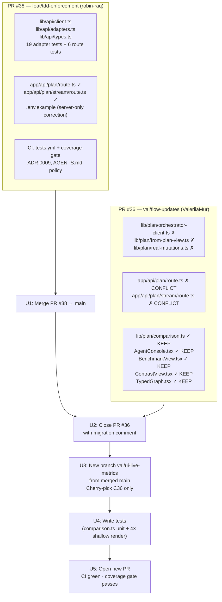
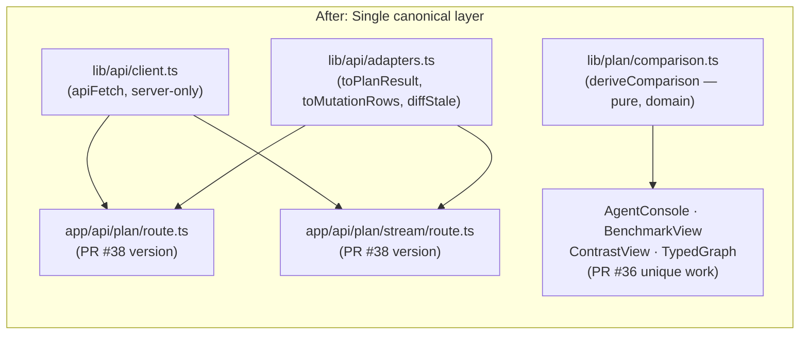

# feat: Migrate PR #36 UI contributions onto PR #38's canonical lib/api/ layer

**Date:** 2026-06-25  
**Status:** active  
**PR conflicts:** #38 (`feat/tdd-enforcement`) and #36 (`val/flow-updates`)  
**Owner:** ValeriiaMur (new PR); robin-raq (PR #38 merge + PR #36 close)

---

## Summary

PR #38 and PR #36 both modify `app/api/plan/route.ts` and `app/api/plan/stream/route.ts` with competing BFF rewires and introduce overlapping abstraction layers for the same job (calling the Hono orchestrator API). This plan sequences #38 first (the tested, CI-gate-compatible canonical layer), closes #36, and migrates its genuine unique contributions — typed-graph interactivity, live benchmark derivation, and `lib/plan/comparison.ts` — into a new coverage-gate-compliant PR that consumes `lib/api/` instead of PR #36's own wiring layer.

---

## Problem Frame

Three direct file conflicts exist between the two open PRs:

| File | PR #38 | PR #36 |
|---|---|---|
| `app/api/plan/route.ts` | +26/-15 via `lib/api/client.ts` | +22/-6 via `lib/plan/orchestrator-client.ts` |
| `app/api/plan/stream/route.ts` | +64/-20 via `lib/api/client.ts` | +80/-7 via `lib/plan/orchestrator-client.ts` |
| `.env.example` | Corrects `API_BASE_URL` as server-only | Adds orchestrator wiring comment block |

Beyond the file conflicts, the two PRs introduce competing abstraction layers for identical jobs:

| Job | PR #38 (canonical) | PR #36 (redundant) |
|---|---|---|
| Fetch from Hono API | `lib/api/client.ts` → `apiFetch()` | `lib/plan/orchestrator-client.ts` → `createPlanViaOrchestrator()` |
| Map PlanView → PlanResult | `lib/api/adapters.ts` → `toPlanResult()` | `lib/plan/from-plan-view.ts` → `planResultFromView()` |
| Map mutations → log rows | `lib/api/adapters.ts` → `toMutationRows()` | `lib/plan/real-mutations.ts` → `realMutationsToLog()` |

PR #36 also carries **unique, non-conflicting contributions** that have no equivalent in PR #38 and must be preserved:

- `lib/plan/comparison.ts` — `LiveMetrics` type + `deriveComparison()`, `fmtTokens()` pure functions for live benchmark derivation
- `components/onboarding/TypedGraph.tsx` — `onSelect` callback + `HoverNode` export (clickable node detail popover)
- `components/onboarding/AgentConsole.tsx` — `selected` state, node-detail popover, `liveMetrics` derivation, `railRef`
- `components/onboarding/BenchmarkView.tsx` — consumes `LiveMetrics` instead of hardcoded fixtures
- `components/onboarding/ContrastView.tsx` — consumes `LiveMetrics`

**Structural tension:** PR #38 also lands the `coverage-gate` CI job (≥90% diff coverage). PR #36 has zero tests, so it would fail that gate the moment it is enforced.

---

## Requirements

- **R1** — PR #38 merges before any migration work begins. It is the prerequisite gate.
- **R2** — PR #36's unique UI contributions (`comparison.ts`, four component files) survive in the new PR.
- **R3** — PR #36's redundant wiring layer (`orchestrator-client.ts`, `from-plan-view.ts`, `real-mutations.ts`) does not land; the new PR uses `lib/api/` exclusively.
- **R4** — The new PR must pass the 90% diff-coverage gate: unit tests for `comparison.ts` and shallow render smoke tests for all four changed components.
- **R5** — All RCG-25/26/27 behavior (live plan projection, real mutation streaming, live benchmark derivation, node-detail hover) is preserved in the new PR against the PR #38 route implementation.
- **R6** — `README.md` and `STATUS.md` updates from PR #36 are ported with references updated from `lib/plan/orchestrator-client.ts` → `lib/api/client.ts`.

---

## Key Technical Decisions

**KTD-1: `lib/api/` is the canonical BFF client layer.**  
PR #38's `lib/api/client.ts` is server-only (enforced by the `'server-only'` sentinel), independently tested, and has no UI coupling. PR #36's `lib/plan/orchestrator-client.ts` mixes network concerns into the domain model layer and has no tests. The `lib/api/` placement wins on every axis: testability, isolation, coverage gate compliance.

**KTD-2: Route files from PR #38 are authoritative; PR #36's route changes are discarded.**  
Both PRs rewire the same two routes. PR #38's versions are TDD-attested (6 route tests). Keeping PR #38's routes and dropping PR #36's route changes is the only path that preserves test coverage and avoids a three-way merge conflict.

**KTD-3: `lib/plan/comparison.ts` stays in `lib/plan/`, not `lib/api/`.**  
`deriveComparison()` and `fmtTokens()` compute UI-facing metrics from a `PlanResult` — they have no network dependency. Domain logic belongs in `lib/plan/`. Moving it to `lib/api/` would violate the layer's single responsibility (network + shape mapping only).

**KTD-4: Tests for migrated code = `comparison.ts` unit tests + shallow component renders.**  
`comparison.ts` is a pure function: straightforward to test with specific input/output assertions. The four component files are tested with Vitest + jsdom shallow renders — enough to catch import/prop-shape mismatches without testing implementation details. This combination achieves 90% diff coverage on the new lines.

---

## High-Level Technical Design

### Conflict Resolution Flow

### Abstraction Layer Mapping (Before → After)

---

## Scope Boundaries

### In Scope
- Sequencing and merging PR #38
- Closing PR #36 with a clear migration comment
- Creating a new branch (`val/ui-live-metrics`) with the salvaged UI work
- Writing unit tests for `comparison.ts` and shallow renders for the four component files
- Porting `README.md` / `STATUS.md` doc updates with updated references

### Deferred to Follow-Up Work
- **U6 / RCG-32 hosted hero pass** — Manual browser checklist on the deployed URL (already tracked in PR #38 as a post-merge step; not in scope here)
- **Native `prog:<slug>` node-id lighting** — Requires a backend change to emit stable node IDs on each `graph_mutations` row; noted as a known gap in PR #36 itself
- **`latestMutationCursor()` paging** — PR #36's mutation cursor assumes <100 prior mutations; fixing cursor-correct paging is a separate backend concern
- **Flipping CI jobs to required checks on `main`** — Tracked in `docs/development/ci-required-checks.md`; admin step post-PR #38 merge

### Out of Scope
- Redesigning the Hono API contract
- Changing the SSE event sequence
- UI changes beyond what PR #36 already introduced

---

## Implementation Units

---

### U1. Merge PR #38 to establish the CI gate and canonical lib/api/ layer

**Goal:** Land `feat/tdd-enforcement` before any migration work begins. This establishes the `lib/api/` client layer as the canonical pattern and activates the coverage-gate CI job that PR #37 (new migration PR) must satisfy.

**Requirements:** R1

**Dependencies:** None

**Files:**
- Merge decision on GitHub for `feat/tdd-enforcement` → `main`

**Approach:**  
Verify CI passes on PR #38 (web-vitest, api-vitest, python-tests, coverage-gate all green). Obtain approval and merge. After merge, confirm `lib/api/client.ts`, `lib/api/adapters.ts`, `lib/api/types.ts`, the two rewired route files, and the coverage-gate workflow are all present on `main`.

**Test scenarios:**
- CI reports `web-vitest`, `api-vitest`, `python-tests`, `coverage-gate` all green before merge
- Post-merge: verify the merged *artifacts*, not commit count (squash/rebase merges collapse history) — `lib/api/client.ts` and `lib/api/adapters.ts` exist on `main` and export `apiFetch`, `toPlanResult`, `toMutationRows`, `diffStale`
- Post-merge: the two rewired route files and the coverage-gate workflow are present on `main`

**Verification:** `main` branch HEAD has PR #38's commits; CI is green; `lib/api/` exists on `main`.

---

### U2. Close PR #36 with a migration comment

**Goal:** Prevent PR #36 from being accidentally merged into the post-#38 `main`. Close it with a comment that explains the conflict, names the specific files to drop and the files to keep, and links forward to the new PR.

**Requirements:** R2, R3

**Dependencies:** U1

**Files:**
- PR #36 comment + close action on GitHub

**Approach:**  
Post a comment on PR #36 explaining: (1) the three direct file conflicts, (2) which of its files are now redundant (`lib/plan/orchestrator-client.ts`, `lib/plan/from-plan-view.ts`, `lib/plan/real-mutations.ts`) and why (duplicated by `lib/api/`), (3) which files carry unique value and must migrate forward (the four component files + `comparison.ts`), (4) that a new branch `val/ui-live-metrics` should be opened from `main` carrying only the unique work. Then close the PR (do not merge).

**Test scenarios:**
- PR #36 is in closed (not merged) state
- Comment is present explaining conflict and migration path with specific file names
- No commits from `val/flow-updates` appear in `main` history

**Verification:** PR #36 shows as closed on GitHub with the migration comment visible.

---

### U3. Create migration branch and cherry-pick UI-only contributions

**Goal:** Create `val/ui-live-metrics` from the freshly-merged `main` and bring forward only the non-conflicting, non-redundant contributions from PR #36: `lib/plan/comparison.ts` and the four component files.

**Requirements:** R2, R3, R5, R6

**Dependencies:** U1, U2

**Files (to create/modify in new branch):**
- `lib/plan/comparison.ts` — new file (pure domain logic; no changes needed)
- `components/onboarding/AgentConsole.tsx` — cherry-picked from PR #36
- `components/onboarding/BenchmarkView.tsx` — cherry-picked from PR #36
- `components/onboarding/ContrastView.tsx` — cherry-picked from PR #36
- `components/onboarding/TypedGraph.tsx` — cherry-picked from PR #36
- `README.md` — port PR #36's additions; replace all references to `lib/plan/orchestrator-client.ts` with `lib/api/client.ts`
- `STATUS.md` — port PR #36's additions; same reference update

**Approach:**  
Branch from `main` post-merge. Manually apply the diffs for the seven files above (per-file extraction using `git show <commit> -- <file>` is required — see ADV-2 note below; git cherry-pick lands the entire commit including the rejected wiring files). Explicitly **do not** add:
- `lib/plan/orchestrator-client.ts` (replaced by `lib/api/client.ts`)
- `lib/plan/from-plan-view.ts` (replaced by `lib/api/adapters.ts::toPlanResult`)
- `lib/plan/real-mutations.ts` (replaced by `lib/api/adapters.ts::toMutationRows`)
- Any changes to `app/api/plan/route.ts` (PR #38 version is authoritative)
- Any changes to `app/api/plan/stream/route.ts` (PR #38 version is authoritative)
- PR #36's `.env.example` block (PR #38's server-only correction is canonical)

Verify that the component files compile cleanly after cherry-pick: `AgentConsole.tsx` imports `LiveMetrics` from `lib/plan/comparison.ts`; `BenchmarkView.tsx` and `ContrastView.tsx` import `deriveComparison` and `fmtTokens` from the same file. No imports should reference the dropped files.

**Test scenarios:**
- `tsc --noEmit` passes on the new branch with no type errors
- `grep -r "orchestrator-client\|from-plan-view\|real-mutations" components/ lib/plan/comparison.ts` returns no matches (no dropped-file imports survived)
- `AgentConsole.tsx` renders `<TypedGraph ... onSelect={setSelected} />` with no type errors
- `BenchmarkView` and `ContrastView` receive `metrics: LiveMetrics` prop and pass it to `deriveComparison()`

**Verification:** New branch has exactly the five code migration files plus two doc updates (seven files total); `tsc` is clean; no references to the three dropped library files exist in the component tree.

---

### U4. Write tests for comparison.ts and shallow component renders

**Goal:** Write tests that pass the 90% diff-coverage gate on the new branch: unit tests for the pure `comparison.ts` functions and Vitest + jsdom shallow renders for the four changed components.

**Requirements:** R4

**Dependencies:** U3

**Files:**
- `lib/plan/comparison.test.ts` — new file
- `components/onboarding/AgentConsole.test.tsx` — new or updated
- `components/onboarding/BenchmarkView.test.tsx` — new or updated
- `components/onboarding/ContrastView.test.tsx` — new or updated
- `components/onboarding/TypedGraph.test.tsx` — new or updated

**Approach:**  
**comparison.ts unit tests** (write these test-first; these are the highest value):
- `deriveComparison()` with a representative `LiveMetrics` fixture: verify the returned rows contain the expected `live: true` cells for token-cost and typed-invalidations-caught
- `deriveComparison()` with `invalidationCaught: false`: verify the invalidation-caught cell reflects "not fired" state
- `fmtTokens()` with sub-1k, 1k-10k, and 10k+ values: verify formatting (e.g., `"1.2k"`, `"12k"`) matches display expectations
- `LiveMetrics` zero-state: `deriveComparison()` never divides, so assert the concrete derived outputs when `planValueCents`/`opCount` are zero (typed/crewai/single `valueCents` = 0, `tokens` = `TOKENS.base`) and that no value is `NaN`/`Infinity`

**Shallow render tests** (catch import/prop mismatches):
- `BenchmarkView` renders without throwing given a minimal `LiveMetrics` object
- `ContrastView` renders without throwing given a minimal `LiveMetrics` object
- `AgentConsole` renders with required props (graph, mutations, etc.) without throwing; `selected` state starts null
- `TypedGraph` renders without throwing; `onSelect` prop is accepted; a simulated click on a node calls `onSelect` with a `HoverNode` shape containing `{ id, label, kind, x, y }`

**Execution note:** Per repo TDD policy (`context/code-standards.md` → Testing, ADR 0009), every changed `**/*.{ts,tsx}` needs test-first (red → green → refactor) coverage. Write `comparison.test.ts` **and** red-phase coverage for `AgentConsole`, `BenchmarkView`, `ContrastView`, and `TypedGraph` before their implementation/cherry-pick lands — component code must not merge ahead of its tests. Pure logic (`deriveComparison`, `nearestHub`, `agentDarkColor`, `dollars`) gets unit tests; components get shallow-render/interaction tests.

**Test scenarios:**
- `npm run test:coverage` passes on the new branch locally with ≥90% coverage on diff lines
- No test imports reference the dropped files (`orchestrator-client`, `from-plan-view`, `real-mutations`)
- `deriveComparison()` unit tests exercise both the `live: true` and illustrative-fixture paths
- All four component shallow renders pass in CI (`web-vitest` job)

**Verification:** `npm run test:coverage` exits 0; coverage report shows ≥90% on changed lines; CI `coverage-gate` job is green on the PR.

---

### U5. Open and verify the new PR

**Goal:** Open `val/ui-live-metrics` as a PR targeting `main`, complete the TDD attestation, and confirm all CI jobs are green.

**Requirements:** R1–R6

**Dependencies:** U1–U4

**Files:**
- New PR on GitHub (`val/ui-live-metrics` → `main`)

**Approach:**  
Push `val/ui-live-metrics` and open the PR. The PR description should:
- List the dropped files and why (`orchestrator-client.ts`, `from-plan-view.ts`, `real-mutations.ts` — replaced by `lib/api/`)
- List the kept unique contributions (four components + `comparison.ts`)
- Include the TDD attestation checklist (red phase for `comparison.test.ts` recorded; all tests green)
- Reference the closed PR #36 as context
- Note that RCG-25/26/27 behavior is preserved via the PR #38 route rewire

After CI runs, verify:
- `web-vitest` — green (new component tests pass)
- `api-vitest` — green (no regressions)
- `python-tests` — green (no regressions)
- `coverage-gate` — green (≥90% diff coverage on the new lines)

**Test scenarios:**
- All four CI jobs pass on the new PR
- PR description contains TDD attestation checklist with red-phase evidence for `comparison.test.ts`
- No files from the dropped wiring layer (`orchestrator-client.ts` etc.) appear in the PR file diff
- `app/api/plan/route.ts` and `app/api/plan/stream/route.ts` are NOT in the PR file diff (they came from PR #38)

**Verification:** CI is green on all four jobs; PR is ready for review by robin-raq.

---

## Open Questions

- **Vitest + jsdom availability:** Confirm that `@testing-library/react` or a jsdom environment is configured in the root `vitest.config.ts` for component shallow renders. PR #38 added Vitest but the web config may need `environment: 'jsdom'` for component tests. Check before writing component tests.
- **`LiveMetrics` zero-state:** Verify `deriveComparison()` handles `planValueCents: 0` without a divide-by-zero in any percentage or ratio computation.

---

## Risks and Dependencies

| Risk | Likelihood | Impact | Mitigation |
|---|---|---|---|
| PR #36 merged before PR #38 | Low | High — creates three-way merge conflicts on `main`; untested code bypasses CI | Close PR #36 (U2) immediately after PR #38 merges; communicate to Val before U1 |
| Component shallow renders require jsdom config not yet present | Medium | Medium — blocks U4 until config is added | Check `vitest.config.ts` `environment` field; add `environment: 'jsdom'` if missing (1-line change) |
| `deriveComparison()` has undiscovered edge cases that break benchmark view | Low | Medium | Zero-state and divide-by-zero unit tests in U4 catch this before CI |
| `STATUS.md` / `README.md` doc updates conflict with other in-flight PRs | Low | Low | These are append-only; standard merge handles it |

---

## Sources and Research

- PR #38 diff: `feat/tdd-enforcement` — 10 commits, file list reviewed inline
- PR #36 diff: `val/flow-updates` — full diff read; component changes and `comparison.ts` exports confirmed
- Architectural decision: `lib/api/` placement matches the server-only BFF pattern established by PR #38's `lib/api/client.ts` (`'server-only'` sentinel)
- Coverage gate spec: `docs/development/ci-required-checks.md` (added by PR #38, 90% diff coverage floor)
