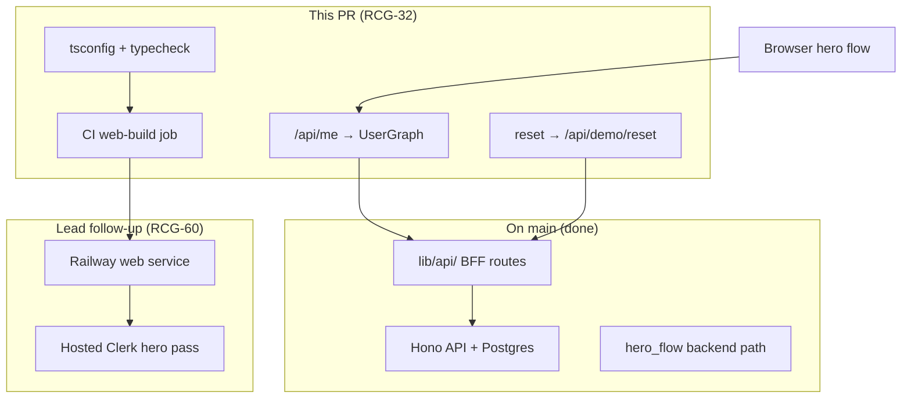
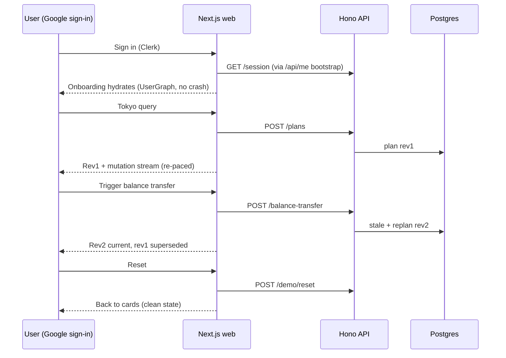

# feat: Close RCG-32 Day-7 hero gate (build, bootstrap, reset, verify)

## Summary

Most of the Day-7 hero path already merged to `main` (backend hero flow, BFF live-API wiring, API deployed on Railway). Four narrow gaps block closing **RCG-32**: the web build fails, CI does not gate the build, `/api/me` returns the wrong shape and crashes onboarding, and the reset control is local-only. This plan closes those gaps in one PR, proves the flow locally with real Clerk, and hands off hosted web deploy (**RCG-60**) to the lead.

**Branch:** `feat/rcg-32-hero-gate` off `origin/main` (`8950550`).

**Demo deadline:** June 29, 2026.

---

## Problem Frame

A repository audit (2026-06-26) against `origin/main` shows the hero path is **demo-complete at the API layer** but **not shippable through the browser**:

| Gap              | Evidence                                                                                                                 | Impact                                                |
| ---------------- | ------------------------------------------------------------------------------------------------------------------------ | ----------------------------------------------------- |
| Web build RED    | `tsconfig.json` has no `target`; `lib/api/adapters.ts` iterates `Set`/`Map` → TS2802                                     | Blocks deploy and any production build                |
| CI gap           | `.github/workflows/tests.yml` has no `next build` / root `tsc` / lint job                                                | Build breaks ship silently                            |
| Bootstrap crash  | `app/api/me/route.ts` returns `ApiSessionResponse`; `OnboardingFlow` casts to `UserGraph` and calls `me.balances.filter` | Runtime `TypeError` on first successful `/api/me` 200 |
| Reset local-only | `onRestart` = `setStep("cards")`; `POST /api/demo/reset` exists but has no UI caller                                     | Hero step 14 (demo reset) unproven                    |
| Web not deployed | API live; Nixpacks web config exists but service not created                                                             | **RCG-60** open                                       |

**Already done (do not re-implement):** backend hero flow (`create_plan` → `balance-transfer` → replan), BFF `lib/api/` wiring (see predecessor plan), Clerk auth, PR #42 UI salvage, PR #40 closed with follow-up **RCG-67**.

**Predecessor:** `docs/plans/2026-06-25-002-feat-frontend-live-api-wiring-plan.md` (BFF swap — landed). This plan is the **verification + closure** pass for the gate.

---

## Requirements

### Build & CI

- R1. `npm run build` succeeds on the PR branch with a valid Clerk publishable key in the environment.
- R2. Root `npm run typecheck` succeeds (production + test files).
- R3. A new CI job runs `typecheck` → `lint` → `build` on every PR; it fails when U1 is reverted.

### Session bootstrap

- R4. `GET /api/me` returns a `UserGraph` (`{ user, balances, goals, holds }`) after a successful backend `getSession` call — not a bare `ApiSessionResponse`.
- R5. `OnboardingFlow` never crashes when `/api/me` returns 200, 401, 403, 500, or a malformed body; cards step still renders in degraded mode.
- R6. Real Clerk identity (name, avatar) overlays the seeded persona per ADR 0006; balances/goals/holds come from `lib/user/` (fixture when web has no `DATABASE_URL`).

### Demo reset

- R7. The "↺ reset" control calls `POST /api/demo/reset` before resetting local UI to the cards step.
- R8. Reset failure surfaces a non-crashing error; local step reset still occurs as UX fallback.

### Verification & gate closure

- R9. Local automated suite passes: web vitest, api vitest, python unittest (non-live).
- R10. One real-Clerk browser walk-through completes the full hero sequence (sign-in → query → rev1 → transfer → rev2 supersede → reset) against a live local API — no fixture plan fallback mistaken for success.
- R11. **RCG-32 → Done** only after merge + evidence (build green, CI gate, bootstrap fixed, browser pass recorded).
- R12. **RCG-60** (hosted web deploy + hosted hero pass) is a separate lead-owned follow-up documented in this plan, not blocked on Val.

---

## Key Technical Decisions

### KTD-1 — `target: "ES2022"` in root `tsconfig.json` (not `downlevelIteration` alone)

Raising `compilerOptions.target` to `ES2022` (matching `apps/api/tsconfig.json`) clears Set/Map iteration errors in `lib/api/adapters.ts` and enables top-level `await` in vitest route tests. Cleaner than `downlevelIteration` on ES5 default; fully supported by Next 14.2 / Node 22.

### KTD-2 — CI typecheck includes test files; fix Clerk mock typing rather than excluding tests

Root `tsc --noEmit` currently reports ~18 errors: 6 production (`adapters.ts`) + 7 top-level-await (fixed by KTD-1) + ~5 Clerk `auth()` mock shape errors in `app/api/plan/stream/route.test.ts`. **Do not** add a CI gate that passes while production is broken, and **do not** permanently exclude `**/*.test.ts` — fix the mock casts using the same `ReturnType<typeof auth>` pattern already in `app/api/me/route.test.ts`.

### KTD-3 — `/api/me`: `getSession` then `resolveSessionGraph` (not either/or)

Keep the backend `getSession(token)` call first (provisioning, connectivity, 401/403 mapping per ADR 0006). On success, return `UserGraph` from `resolveSessionGraph()` / `getCurrentUserGraph()`. Do **not** return `ApiSessionResponse` to the client. Do **not** change `app/api/plan/stream/route.ts`'s separate `getSession` usage.

**Known limitation (documented):** web tier without `DATABASE_URL` serves persona graph from `fixtures/demo-seed.json`; plans/transfers still hit live API/Postgres. Backend-served live persona graph for hosted web is post-demo scope.

### KTD-4 — Reset: API call then local UI reset

`onRestart` posts to `/api/demo/reset` (reuse `app/api/demo/reset/route.ts`), then `setStep("cards")`. Errors are surfaced; local reset is fallback.

### KTD-5 — PR #40 superseded; real-stream deferred to RCG-67

PR #40 is **closed** (head `c88e5e1`). Usable UI merged via PR #42. Real `GET /mutations/stream` consumption tracked as **RCG-67** (Val, post-demo). Rationale comment posted on PR #40.

### KTD-6 — File freeze until hero-gate PR merges

These files are owned exclusively by the RCG-32 PR author until merge:

`tsconfig.json`, `package.json`, `.github/workflows/tests.yml`, `app/api/me/route.ts`, `components/onboarding/OnboardingFlow.tsx`, `components/onboarding/AgentConsole.tsx`, `lib/user/session.ts` (and their tests).

Val pivots to RCG-45/46 shells and sign-in driver; does not edit frozen files.

---

## High-Level Technical Design

**What remains vs what already works:**



**Hero verification sequence (local browser pass):**



---

## Implementation Units

### U1. Make production build and root typecheck green

- **Goal:** Clear all `tsc` and `next build` blockers.
- **Requirements:** R1, R2.
- **Dependencies:** None.
- **Files:** `tsconfig.json`, `package.json`, `app/api/plan/stream/route.test.ts` (Clerk mock casts).
- **Approach:** Add `"target": "ES2022"` to `compilerOptions`. Add script `"typecheck": "tsc --noEmit"`. Fix remaining Clerk `auth()` mock typing in `app/api/plan/stream/route.test.ts` to match the pattern in `app/api/me/route.test.ts`. No production logic changes.
- **Patterns to follow:** `apps/api/tsconfig.json` target; existing vitest mock style in `app/api/me/route.test.ts`.
- **Test scenarios:**
  - Happy: `npm run typecheck` exits 0.
  - Happy: `npm run build` exits 0 with `NEXT_PUBLIC_CLERK_PUBLISHABLE_KEY` set.
- **Verification:** `npm run typecheck && npm run build` clean locally.

### U2. Add CI web-build gate

- **Goal:** Prevent silent web build regressions.
- **Requirements:** R3.
- **Dependencies:** U1.
- **Files:** `.github/workflows/tests.yml`.
- **Approach:** Add `web-build` job: `npm ci` → `npm run typecheck` → `npm run lint` → `npm run build`. Set `NEXT_PUBLIC_CLERK_PUBLISHABLE_KEY` from a CI variable (public test key, not a secret). No `continue-on-error`. Do not weaken existing jobs (`web-vitest`, `api-vitest`, `python-tests`, `coverage-gate`, `apply-schema`). Note in PR description: flipping the job to _required_ in the GitHub ruleset is a lead admin step.
- **Test expectation:** none — CI config only; prove by PR workflow run.
- **Verification:** `web-build` job green on PR; fails if U1 `target` is reverted.

### U3. Fix `/api/me` bootstrap and harden `OnboardingFlow`

- **Goal:** Onboarding hydrates without crash; `/api/me` matches `design-context.md` contract.
- **Requirements:** R4, R5, R6.
- **Dependencies:** U1.
- **Files:** `app/api/me/route.ts`, `app/api/me/route.test.ts`, `components/onboarding/OnboardingFlow.tsx`, `components/onboarding/OnboardingFlow.test.tsx`, reuse `lib/user/session.ts`, `lib/user/types.ts`.
- **Approach:** In `GET /api/me`: call `getSession(token)`; on success call `resolveSessionGraph()` and return `{ user, balances, goals, holds }`. Map `SessionResolution` errors to 401/403/500. Update `route.test.ts` to assert `UserGraph` shape (not `ApiSessionResponse`). In `OnboardingFlow`: remove unsafe `as Promise<UserGraph>` cast; validate graph shape before `setMe`; guard `me.balances` reads; explicit loading/error/degraded states.
- **Execution note:** Start with a failing `OnboardingFlow` test that reproduces the `me.balances.filter` crash when `/api/me` returns identity-only payload; green it.
- **Patterns to follow:** `lib/user/current.ts` (Clerk identity overlay); `context/design-context.md` (`GET /api/me` → `UserGraph`); ADR 0006.
- **Test scenarios:**
  - Happy: signed-in + provisioned → `/api/me` 200 with `{ user, balances, goals, holds }`; `OnboardingFlow` shows first name and `pointsOnHand` from selected-card programs without throwing.
  - Edge: empty `balances` / null `displayName` → greeting uses fallback, `pointsOnHand` = 0, no crash.
  - Edge: identity-only legacy payload → treated as malformed, no crash, cards still load.
  - Error: no token → 401; unprovisioned → 403; backend down → 500; onboarding renders cards in degraded mode.
  - Integration: toggling a card updates `pointsOnHand` from `me.balances` filtered by `programName`.
- **Verification:** `npm test` green for `app/api/me/route.test.ts` and `OnboardingFlow.test.tsx`.

### U4. Wire demo reset control to backend

- **Goal:** Reset restores pristine persona in DB, not just local UI state.
- **Requirements:** R7, R8.
- **Dependencies:** U3 (onboarding flow stable).
- **Files:** `components/onboarding/OnboardingFlow.tsx` and/or `components/onboarding/AgentConsole.tsx`, corresponding test file(s), reuse `app/api/demo/reset/route.ts`.
- **Approach:** `onRestart` calls `fetch("/api/demo/reset", { method: "POST" })`, then `setStep("cards")`. Surface error on failure; still reset local step.
- **Execution note:** Test-first on reset handler.
- **Test scenarios:**
  - Happy: click reset → `POST /api/demo/reset` called once → UI returns to cards step.
  - Error: reset endpoint 500 → error surfaced, no crash, local step still resets.
  - Integration: after plan + replan, reset returns clean cards state ready to re-run.
- **Verification:** vitest green; reset step included in browser pass (R10).

### U5. Gate evidence and handoffs (no code in hero-gate PR)

- **Goal:** Close social/process items; document RCG-60 handoff.
- **Requirements:** R11, R12.
- **Dependencies:** U1–U4 merged.
- **Deliverables:**
  - PR #40 rationale comment — **done** (see PR #40#issuecomment-4811374389).
  - **RCG-67** created for post-demo real `/mutations/stream` (Val).
  - Browser pass evidence (screenshots, network panel confirming live API calls — no tokens/secrets).
  - Linear: RCG-32 → Done with evidence link; RCG-60 remains In Progress until hosted pass.
- **RCG-60 handoff (lead-owned):** Deploy web as second Railway **Nixpacks** service (not API `Dockerfile`); env: `API_BASE_URL` (server-only), Clerk vars, **no `DATABASE_URL`** on web; Clerk dashboard add hosted origin; API `CORS_ORIGIN` = exact web origin; API min-instances ≥ 1; re-run hero flow hosted.

---

## Verification Strategy

### Local automated (after U1–U4, before merge)

```bash
npm run typecheck && npm run lint && npm test && npm run build
npm --prefix apps/api run typecheck && npm --prefix apps/api test
python3 -m unittest discover -s tests -v
```

### Live Postgres (Alan lane; supports gate, not blocking web PR)

```bash
RUN_LIVE_POSTGRES_TESTS=1 PGDATABASE=rewards_test \
  python3 -m unittest tests.integration.test_hero_moment -v
```

### Local real-Clerk browser pass (RCG-32 closure evidence)

**Prerequisites:** Postgres (`docker compose up -d postgres` + `./scripts/dev-db-setup.sh`), API (`npm --prefix apps/api run dev`, :8787), web (`npm run dev`, :3000), `API_BASE_URL=http://localhost:8787`.

**Steps:** Sign in (Val or lead drives Google OAuth) → `/api/me` 200 with graph → Tokyo query → rev1 renders → mutations stream → balance transfer → rev1 stale/superseded → rev2 current → reset → repeat.

**Pass criteria:** No render crash; network panel shows live Hono calls (not `lib/plan/builder.ts` fixture path); screenshots captured without secrets.

### Hosted pass (RCG-60; after web deploy)

Same sequence against hosted web URL with real Clerk token; confirm CORS, SSE, reset.

---

## Scope Boundaries

### In scope

- U1–U4 in one PR on `feat/rcg-32-hero-gate`.
- CI `web-build` job.
- Local browser verification for RCG-32.

### Deferred to follow-up work

- **RCG-60:** Hosted web deploy + hosted hero/SSE/reset verification (lead).
- **RCG-67:** Real `GET /mutations/stream` in frontend (Val, post-demo).
- **RCG-45/46:** Contrast/benchmark UI with real numbers (blocked on RCG-37).
- Backend-served live persona graph on hosted web (no `DATABASE_URL` on web tier).
- `apps/web` directory migration (ADR 0004).
- Track B benchmark run (Michael: RCG-36 → RCG-37).

### Out of scope

- Reopening or merging PR #40 / `val/flow-updates`.
- Wallet/earning agents (RCG-16/17).
- Layer 4 ingestion/verifier (RCG-39 NO-GO).

---

## Team ownership (no overlap)

| Person         | Owns today                                                                    | Frozen / do not touch  |
| -------------- | ----------------------------------------------------------------------------- | ---------------------- |
| **Raq (lead)** | `feat/rcg-32-hero-gate` PR (U1–U4), merge, RCG-60 deploy, Linear gate updates | —                      |
| **Val**        | RCG-45/46 UI shells, sign-in driver, RCG-67 backlog                           | 7 frozen files (KTD-6) |
| **Michael**    | RCG-36 → RCG-37 (Track B)                                                     | Frontend, hero-gate PR |
| **Alan**       | Live-Postgres hero suite + reproducible DB deploy                             | Frontend, hero-gate PR |

---

## Risks & Dependencies

| Risk                                                         | Mitigation                                                                |
| ------------------------------------------------------------ | ------------------------------------------------------------------------- |
| Root `tsc` still fails after `target` ES2022 (Clerk mocks)   | Fix in U1 before U2 CI gate ships; do not exclude tests                   |
| `getSession` succeeds but graph resolution fails differently | Keep `getSession` first; return 403 on unprovisioned before graph overlay |
| Fixture persona mistaken for live success in browser pass    | Require network-panel evidence of Hono `/plans` and `/balance-transfer`   |
| Railway web picks API Dockerfile                             | Pin web service to Nixpacks per KTD-4 in predecessor plan                 |
| Two agents editing same files                                | One writer on hero-gate branch; Val frozen                                |

**Dependencies:** `origin/main` at `8950550`; live API at `api-production-d6f4c.up.railway.app`; Clerk dev instance; `./scripts/dev-db-setup.sh` for local stack.

---

## Linear closure criteria

| Ticket     | Done when                                                                                           |
| ---------- | --------------------------------------------------------------------------------------------------- |
| **RCG-32** | U1–U4 merged; `web-build` CI exists; local real-Clerk hero pass evidenced; no fixture plan fallback |
| **RCG-60** | Web deployed; hosted Clerk + CORS; hosted hero/SSE/reset verified                                   |

Update Linear **after merge** with evidence links (PR URL, screenshot location, workflow run).

---

## Sources & Research

- Predecessor plan: `docs/plans/2026-06-25-002-feat-frontend-live-api-wiring-plan.md` (KTD-2/3 BFF + re-paced SSE).
- Backend handoff: `docs/development/backend-local-setup.md`.
- Deploy: `docs/deployment/railway.md`.
- Design contract: `context/design-context.md` (`GET /api/me` → `UserGraph`).
- ADR 0006: `docs/adr/0006-clerk-identity-only.md`.
- PR #40 closed: https://github.com/RCG5-26/rewards-typed-graph/pull/40 — follow-up **RCG-67**.
- PR #42 merged: `8950550` (UI salvage).
